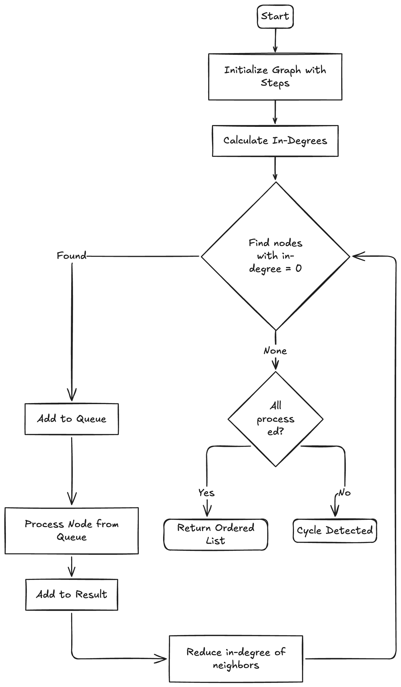

# Kubo

## Problem Statement
**Upgrading Kubernetes clusters is risky and complex:**
- ❌ Deprecated APIs are removed without warning, breaking production workloads
- ❌ Helm charts become incompatible across Kubernetes versions
- ❌ CRDs may use deprecated API versions that fail after upgrade
- ❌ No clear upgrade path or dependency ordering exists

**What Kubo Does**
- ✅ Scans your cluster for deprecated APIs, Helm releases, and CRDs
- ✅ Analyzes manifest files for API deprecations
- ✅ Detects incompatible Helm chart versions
- ✅ Generates dependency-aware upgrade plans with topological sorting
- ✅ Provides actionable migration steps and risk signals
- ✅ Exposes REST API for CI/CD integration

## Quick Start
### Prerequisites

- Go 1.21 or higher
- Access to a Kubernetes cluster (optional for manifest-only mode)
- kubectl configured (optional)

### Installation
```
# Clone the repository
git clone https://github.com/yourusername/kube-upgrade-advisor.git
cd kube-upgrade-advisor

# Install dependencies
go mod download

# Generate database schema
go generate ./internal/db/ent

# Build binaries
go build -o kube-upgrade-advisor ./cmd/cli
go build -o kube-upgrade-server ./cmd/server
```

### Quick Test (No Cluster Required)
```
# Scan manifests only
./kube-upgrade-advisor scan --manifest-only --manifests ./test-manifests

# View inventory
./kube-upgrade-advisor list

# Analyze upgrade impact
./kube-upgrade-advisor impact --target 1.25
```

## Usage Guide
### CLI Commands
#### 1. Scan Your Cluster
**Scans Kubernetes cluster, Helm releases, CRDs, and local manifests:**
```
# Full cluster scan
./kube-upgrade-advisor scan --manifests ./manifests

# Manifest-only mode (no cluster access needed)
./kube-upgrade-advisor scan --manifest-only --manifests ./manifests

# Custom database location
./kube-upgrade-advisor scan --db /path/to/db.sqlite --manifests ./manifests
```
**Options:**

- `--manifests` : Path to manifest folder (default: `./manifests`)

- `--manifest-only` : Skip cluster scan, only parse manifests

- `--db` : Database file path (default: `kube-advisor.db`)

- `--kubeconfig` : Path to kubeconfig (default: `~/.kube/config`)

#### 2. View Inventory
**List all scanned resources:**
```
./kube-upgrade-advisor list
```
**Example Output:**

```
=== Cluster Inventory ===
Cluster: cluster-1
Version: v1.21.0

Helm Releases (2):
  - monitoring/prometheus (chart: prometheus-20.0.0)
  - ingress-nginx/nginx-ingress (chart: nginx-ingress-3.0.0)

CRDs (5):
  - certificates.cert-manager.io (group: cert-manager.io, kind: Certificate)
  - issuers.cert-manager.io (group: cert-manager.io, kind: Issuer)

Manifest APIs (4):
  - networking.k8s.io/v1beta1 Ingress (count: 2)
  - policy/v1beta1 PodSecurityPolicy (count: 1)
```
#### 3. Analyze Upgrade Impact

**Analyze impact of upgrading to a specific Kubernetes version:**

```
# Analyze upgrade to 1.25
./kube-upgrade-advisor impact --target 1.25

# Analyze upgrade to 1.28
./kube-upgrade-advisor impact --target 1.28
```

**Example Output:**

```
=== Upgrade Impact Assessment ===
Cluster: cluster-1
Current Version: v1.21.0
Target Version: 1.25
Overall Risk: critical
Total Issues: 4

⚠️  DEPRECATED MANIFEST APIs (2)
━━━━━━━━━━━━━━━━━━━━━━━━━━━━━━━━━━━━━━━━━━━━━━━━━
1. networking.k8s.io/v1beta1 Ingress
   Impact: critical
   Removed In: v1.22
   Replacement: networking.k8s.io/v1
   Migration: Update apiVersion to networking.k8s.io/v1

2. policy/v1beta1 PodSecurityPolicy
   Impact: critical
   Removed In: v1.25
   Replacement: Pod Security Admission
   Migration: Migrate to Pod Security Standards

📦 INCOMPATIBLE HELM CHARTS (1)
━━━━━━━━━━━━━━━━━━━━━━━━━━━━━━━━━━━━━━━━━━━━━━━━━
1. prometheus (namespace: monitoring)
   Current Version: 20.0.0
   Recommended Version: 25.0.0
   Impact: high
   Message: Upgrade required for Kubernetes 1.25

📋 UPGRADE PLAN
━━━━━━━━━━━━━━━━━━━━━━━━━━━━━━━━━━━━━━━━━━━━━━━━━
   1. [precheck] Pre-upgrade validation and checks
   2. [backup] Backup cluster state and critical resources
   3. [api_migration] Migrate networking.k8s.io/v1beta1 Ingress
   4. [api_migration] Migrate policy/v1beta1 PodSecurityPolicy
   5. [chart_upgrade] Upgrade prometheus from 20.0.0 to 25.0.0
   6. [cluster_upgrade] Upgrade Kubernetes from v1.21.0 to 1.25
   7. [validation] Post-upgrade validation

Estimated Timeline: Approximately 3 hours
```
### REST API Server
**Start the API server for programmatic access:**
```
./kube-upgrade-server
```
**Default Port:** 8080

#### API Endpoints
- Health Check
```
GET /health

curl http://localhost:8080/health
```
Response:
```
{
  "status": "healthy"
}
```

- List Clusters
```
GET /clusters

curl http://localhost:8080/clusters | jq
```
Response:
```
[
  {
    "id": "cluster-1",
    "name": "my-cluster",
    "version": "v1.21.0"
  }
]
```
- Get Impact Assessment

```
GET /impact?cluster=<cluster-id>&target=<k8s-version>

curl "http://localhost:8080/impact?cluster=cluster-1&target=1.25" | jq
```
Response:
```
{
  "clusterId": "cluster-1",
  "currentVersion": "v1.21.0",
  "targetVersion": "1.25",
  "deprecatedManifestAPIs": [...],
  "deprecatedCRDAPIs": [...],
  "incompatibleCharts": [...],
  "riskSignals": [...],
  "orderedUpgradeSteps": [...],
  "overallRisk": "critical",
  "totalIssues": 4
}
```

## Knowledge Base
The tool uses curated JSON files for deprecation and compatibility data.

### API Deprecations (`knowledge-base/apis.json`)
Tracks Kubernetes API deprecations and removals:
```
{
  "deprecations": [
    {
      "group": "networking.k8s.io",
      "version": "v1beta1",
      "kind": "Ingress",
      "deprecatedIn": "1.19",
      "removedIn": "1.22",
      "replacementAPI": "networking.k8s.io/v1",
      "migrationNotes": "Update apiVersion and adjust spec fields"
    }
  ]
}
```

### Chart Compatibility Matrix (`knowledge-base/chart-matrix.json`)
Tracks Helm chart compatibility with Kubernetes versions:
```
{
  "charts": [
    {
      "chartName": "nginx-ingress",
      "repository": "https://kubernetes.github.io/ingress-nginx",
      "versions": [
        {
          "chartVersion": "4.8.0",
          "minKubeVersion": "1.25",
          "maxKubeVersion": "1.29",
          "compatibleWith": ["1.25", "1.26", "1.27", "1.28", "1.29"],
          "knownIssues": []
        }
      ]
    }
  ]
}
```

## Contributing to Knowledge Base
All are welcome contributions to improve accuracy! The knowledge base is community-driven.

**Adding API Deprecations**

1. Edit `knowledge-base/apis.json`
2. Add deprecation entry with:

    -  `group`, `version`, `kind`
    - `deprecatedIn`, `removedIn` (Kubernetes versions)
    - `replacementAPI`, `migrationNotes`


3. Test with:
```
./kube-upgrade-advisor impact --target <version>
```

4. Submit a PR with:
    - Description of the API
    - Kubernetes version tested
    - Reference to official docs

**Adding Chart Compatibility**

1. Edit `knowledge-base/chart-matrix.json`
2. Add chart entry with compatibility matrix
3. Test with actual deployments
4. Submit PR with test results

**Contribution Guidelines**

- **Verify accuracy:** Test with real clusters when possible
- **Add references:** Link to official documentation
- **Update tests:** Add test cases for new entries
- **Follow format:** Maintain consistent JSON structure

## Configuration
### Environment Variables

| Variable               | Description                              | Default                         |
|------------------------|------------------------------------------|---------------------------------|
| `DATABASE_URL`         | Path to SQLite database                  | `kube-advisor.db`               |
| `KUBECONFIG`           | Path to kubeconfig file                  | `~/.kube/config`                |
| `API_KNOWLEDGE_PATH`   | API deprecation JSON                     | `knowledge-base/apis.json`      |
| `CHART_KNOWLEDGE_PATH` | Chart compatibility JSON                 | `knowledge-base/chart-matrix.json` |
| `PORT`                 | Server port (server only)                | `8080`                          |


### CLI Flags
```
# Global flags
--db string              Database file path
--kubeconfig string      Path to kubeconfig
--api-knowledge string   Path to API knowledge base
--help                   Show help

# Scan command
--manifests string       Manifest folder path
--manifest-only          Skip cluster scan

# Impact command
--target string          Target Kubernetes version (required)
```
## Algorithms

### Topological Sort (Kahn's Algorithm)
Used for ordering upgrade steps based on dependencies.



### Code snippet:

```go
func (p *Planner) topologicalSort() ([]UpgradeStep, error) {
    // Calculate in-degrees
    inDegree := make(map[string]int)
    for id := range p.graph {
        inDegree[id] = 0
    }
    for _, neighbors := range p.edges {
        for _, neighbor := range neighbors {
            inDegree[neighbor]++
        }
    }
    
    // Queue for zero in-degree nodes
    queue := []string{}
    for id, degree := range inDegree {
        if degree == 0 {
            queue = append(queue, id)
        }
    }
    
    // Process queue
    var result []UpgradeStep
    order := 0
    
    for len(queue) > 0 {
        current := queue[0]
        queue = queue[1:]
        
        step := p.graph[current]
        step.Order = order
        result = append(result, *step)
        order++
        
        // Reduce in-degree for neighbors
        for _, neighbor := range p.edges[current] {
            inDegree[neighbor]--
            if inDegree[neighbor] == 0 {
                queue = append(queue, neighbor)
            }
        }
    }
    
    // Check for cycles
    if len(result) != len(p.graph) {
        return nil, fmt.Errorf("cycle detected")
    }
    
    return result, nil
}
```